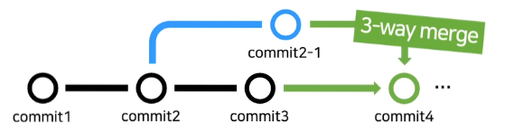
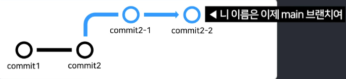
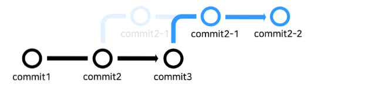
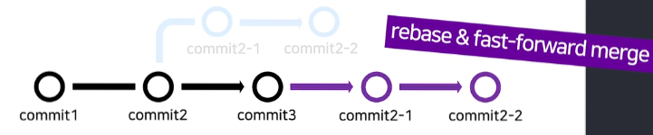
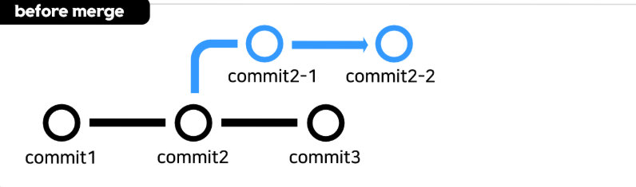
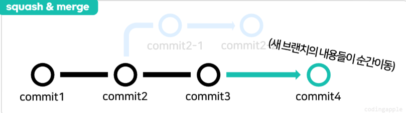

# Git / Github

## 1. git 설치법 (윈도우)

### git이란?
- 버전관리 소프트웨어
- 작업한 코드를 기록, 보관 기능
- 과거로 이전 가능
- 과거 작업 내용 열람 가능

### git install
- git download window 버전 설치
- 설치 시 설정 사항 (Optional / Recommand)
    - Use Visual Studio Code as Git's default editor
        - VSC를 git 기본 에디터로 설정

    - Override the default branch name for new repositories - main
        - 새로운 저장소 브랜치 이름을 기본으로 main으로 설정 -> 나중에 github 연동 시 좋음

### git 최초 설정
- 아무 폴더나 만들고 shift + 우클릭
- powershell 열기
```bash
git --version # git이 잘 설치되었는지 확인
git config --global user.email "내가 사용할 이메일"
git config --global user.name "내가 사용할 이름"
```
    - --global: 내 컴퓨터에 전역으로 이 설정을 적용한다는 의미
    - user.email: 내가 사용할 이메일
    - user.name: 내가 사용할 이름

---

## 2. git add, commit으로 파일 기록

### 코드 짜면서 git 사용해보기
- 작업 폴더에서 git을 사용하고 싶으면 git init부터 입력
```bash
git init
```
    - git이라는 소프트웨어가 해당 작업 폴더를 감사, 추적하기 시작함

- 폴더를 하나 만들고 app.py라는 파일을 생성
```python
print("Hello World")
```

- 이제 이 파일에 대해서 기록을 남기로 싶다면?
```bash
git add app.py
git commit -m "create app.py"
```
    - git add <파일명>
    - git commit -m "내가 무엇을 했는지 작성"

- 만약에 해당 파일에 코드를 더 작성했다면?
```python
print("Hello World")
print("update app.py")
```

```bash
git add app.py
git commit -m "update app.py"
```

### staging이라는 용어
- 왜 굳이 2개를 입력해야하는 것일까? (add / commit)
    - 모든 파일 굳이 다 기록할 필요가 없음
    - git add라는 명령어를 통해 내가 기록할 파일부터 고르고
    - git commit이라는 명령어로 실제 기록을 
    
- 지금까지의 흐름
    - 작업 폴더 <-git add-> [ staging area ] <-git commit-> [ repository(저장소) ]

- staging
    - commit할 파일을 골랐다는 뜻

### 유용한 명령어
- git add & commit을 동시에 해주는 명령어도 있음
```bash
git commit -am "메세지"
```
    - 수정된 파일을 한 번에 스테이징 후 한 번에 커밋
    - 주의사항
        - 신규로 생성된 파일(git이 추적하지 못함)은 안됨
        ```bash
        git add . # 해당 폴더의 전체 파일 추가 (물론 gitignore 목록은 포함이 안됨)
        git commit -m "메세지"
        ```

- 만약 여러 개의 파일을 스테이징하고 싶다면?
```bash
git add app.py test_controller.py # 특정 두개 파일 스테이징
git add . # 전체 파일 스테이징
```

- 상태창 열기
```bash
git status
```
    - 어떤 파일을 스테이징 했는지
    - 어떤 파일을 수정했는지
    - 등 현재 상태를 볼 수 있음

- 내가 커밋한 내역을 보고 싶다면?
```bash
git log --all oneline
```

---

## 3. git add, commit, diff 쉽게 하는 법 (VSCode)

### git commit 뭐하러 입력함?
- VSCode에서 GUI로 git add, commit 쉽게 가능
    - Changes 항목에서 +를 눌러서 스테이징할 수 있음 (git add)
    - Staged Changes에서 -를 눌러서 스테이징을 해제 할 수 있음 (???)
    - Commit을 누르기 전에 위에 메세지를 입력해야함 (안 하면 하라고 뜨는데 귀찮음) (git commi -m)

### git diff
- commit을 그냥 막하면 안 좋음
- commit하기 전에 이전 commit과의 파일 차이점을 확인하는 것이 좋음
```bash
git diff
```
    - 이전 commit과의 어떤 파일에서 어떤 차이가 있는지 확인할 수 있음
    - j/k로 스크롤바 조작
    - q로 종료
    - 참고할 점: 엔터키 입력도 파일의 수정으로 입력함 (그러니깐 아무것도 안하고 옆에 엔터를 눌러도 diff로 인식함)   
        - 그냥 모든 행위를 차이점으로 인식함

- 만약 좀 더 고급지게 확인하고 싶다면?
```bash
git difftool
```
    - vim editor가 뜸
    - 여기서 차이점을 분석할 수 있음
    - vim 사용법과 동일

- 조금 더 유용한 기능
```bash
git difftool <커밋아이디>
git difftool <커밋아이디1> <커밋아이디2>
```
    - 현재 파일 vs 특정 커밋 비교 가능
    - 커밋아이디1 vs 커밋아이디2 비교 가능

- 커밋 아이디란?
```bash
git log --oneline --all
# 0404cbd (HEAD -> main) update app.py add study git diff 2
# b521fb0 update app.py delete update app.py add study git diff
```
    - 여기서 맨 앞에 b521fb0같이 16진수로 나오는 이상한 숫자가 바로 커밋 아이디

### 에디터 부가기능
- 에디터에서 설치할 수 있는 VSCode의 경우 Extension을 설치해서 좋은 툴을 사용하는게 더 좋을 수도 있음
    - git graph 
    
---

## 4. git의 branch 만들기

### branch 만드는 법
- 만약에 새로운 기능을 추가하고 싶다면? -> 버그 발생하거나 망할 수도 있음
- 기본적인 방법
    - 파일 복사본을 만듦
    - 코드를 먼저 짜보고 실행
    - 안심하고 기존 코드에 반영

- branch 기능을 이용하면 위의 과정을 쉽게 할 수 있음 (commit의 복사본을 만드는 것임)
```bash
git branch <작명>
git branch test_service
```
    - 작명이라는 이름으로 브랜치를 하나 만들 수 있음

- 특정 브랜치로 이동하고 싶다면?
```bash
git switch test_service
```
    - test_service라는 브랜치로 이동할 수 있음

- 지금 내가 어느 브랜치에 있는지 알고 싶다면?
```bash
git status
# On branch test_service
```
    - 현재 내가 test_service라는 브랜치에 있다는 것을 알 수 있음
    - 참고사항: 원래 맨 처음 브랜치명은 main임 (초반에 설정을 그렇게 했음 - git 최초 설정 참고)
    - main말고 master라는 이름으로 되어 있을 수도 있음

- 이제 이동한 브랜치에 동일하게 git add, commit 등을 할 수 있음
    - 완전히 다른 작업 공간임
    - 이제 test_service.py라는 파일을 하나 생성
```bash
git add test_service.py # 또는 git add .
git commit -m "create test_service.py"
git log --oneline --all
# 0471411 (HEAD -> test_service) create test_service.py
# 0404cbd (main) update app.py add study git diff 2
# b521fb0 update app.py delete update app.py add study git diff
# b9a28d9 update app.py and create test_controller.py
```
    - 로그를 보면 HEAD -> test_service를 가리키고 있는 것을 볼 수 있음

- 이제 브랜치 간의 이동이 가능함
```bash
git swtich main
```
    - test_service.py가 없어진 것을 확인할 수 있음
    - 진짜로 없어진게 아니라 브랜치를 이동해서 원래 main의 commit 기록에는 test_service.py라는 파일이 없었기 때문임
    - 다시 test_service 브랜치로 이동하면 생김

### 해보기
- main / test_service 브랜치에서 각각 작업하기
```bash
git switch main
# test_controller.py 수정
git add .
git commit -m "update test_controller.py"
```

```bash
git switch test_service
# test_service.py 수정
git add .
git commit -m "update test_service.py"
```

- 로그 확인해보기
```bash
git log --oneline --all --graph
# * 12e5e4c (HEAD -> main) update test_controller.py
# | * 4ac970a (test_service) sorry update test_service.py really
# | * 2b7128b update test_controller.py
# | * 0471411 create test_service.py
# |/  
# * 0404cbd update app.py add study git diff 2
# * b521fb0 update app.py delete update app.py add study git diff
# * b9a28d9 update app.py and create test_controller.py
# * 81261a9 create app.py
```
    - 지금까지의 기록이 그래프 형태로 나오는 것을 볼 수 있음
    - 중간에 튀어나가는게 있는데 저게 바로 브랜치가 이동했다는 것임
    - HEAD는 현재 나의 위치

### 브랜치 합치기 (merge)
- main 브랜치에 test_service 브랜치를 합치고 싶다면? (merge)
```bash
git switch main # 기준이 되는 브랜치로 이동해야함
git merge test_service # 합칠 브랜치 명
```

- 자 근데 위의 마지막 명령어를 수행하기 전 발생할 수 있는 두 가지 시나리오를 봐보자
    - 1. 각 브랜치에서 완전히 다른 파일을 수정했다면? -> 그냥 바로 merge 성공
    - 2. 각 브랜치에서 겹치는 파일을 수정했다면? -> 충돌이 발생함 (conflict)
        - 이 경우 충돌을 수동으로 해결해주어야함!!

### 합칠 때 conflict 발생 가능
- 시나리오 생성
```python 
# main - app.py
print("Hello World")
print("study git diff")
print("study git diff 2") 

print("main branch update")
```

```bash
git switch main
git add .
git commit -m "update app.py main-branch"
```

``` python
# test_service - app.py
print("Hello World")
print("study git diff")
print("study git diff 2") 
print("test_service branch update")
```

```bash
git switch test_service
git add .
git commit -m "update app.py test_service-branch"
```

- 합치기
```bash
git switch main
git merge test_service
``` 

```python
print("Hello World")
print("study git diff")
print("study git diff 2") 
<<<<<<< HEAD

print("main branch update")
=======
print("test_service branch update")
>>>>>>> test_service
```
    - 다음과 같이 app.py에 충돌이 일어났음을 확인할 수 있음
    - 저 HEAD (Current Change) ~ ===까지가 현재 branch에서 다른 영역
    - === ~ test_service (Incoming Change)까지가 다른 브랜치에서는 이렇게 되어있다
    - 즉 충돌되는 영역을 보여주고, 그 부분을 실제로 수정해야함

- 수정을 해보자
```python
print("Hello World")
print("study git diff")
print("study git diff 2")

print("test_service branch update")
```
    - 수정을 하고 반드시 git add / commit을 수행해주어야 실제로 반영이 됨
    - 추가로 merge 했다고 브랜치가 없어지는 것이 아님
        - 다른 브랜치의 내용을 merge하고자하는 브랜치의 내용에 적용한다는 의미
        - 그리고 충돌이 안 일어나는건 자동으로 merge됨 (주의해야할 수도 있음 - 바로 눈에 띄지 않기 때문)

---

## 5. 다양한 git merge 방법 (3-way, fast-forward, squash, rebase)

### 3-way merge
- 기존에 했던 merge 전략
- 설명하자면, main에서도 커밋이 계속되고 있고, 새 브랜치에서도 커밋을 하다가 합치고 싶으면 
- 자동으로 3-way merge가 일어나게 됨
> 

### fast-forward merge
- main에서 브랜치를 하나 파고, main에서는 이제 commit을 하지 않는다면?
- 그냥 새 브랜치를 main 브랜치로써 사용함
> 
    - 자동으로 발동함
    - 왜 사용할까?
        - 딱히 브랜치간의 차이점이 없기 때문임

- 오해하면 안되는 개념
    - main에서 이미 새로운 브랜치를 파고, 그 이후 main에서도 커밋, 새 브랜치에서도 commit을 하다가 merge를 진행
    - 그 후 새 브랜치에서 다시 커밋을 진행하고, main에서는 커밋을 진행하지 않는다면? -> 이때 Fast-Forward일까? -> No -> ORT라는 merge가 동작함 (이건 일단 나중에 필요하면 알아보자)
    - 완전히 새 브랜치를 main의 최근 commit을 기반으로 판 후에, main은 commit을 진행하지 않고, 브랜치2에서 commit을 진행하고 나중에 merge를 진행할 경우 -> Fast-Forward merge 발동

- 실습으로 봐보자
```bash
git branch ff
git switch ff
```

```python
# test_ff.py 생성
print("test_ff")
```

```bash
git add .
git commit -m "create test_ff.py"
git switch main
git merge ff
# Updating 0c0252e..dc330c1
# Fast-forward
#  test_ff.py | 3 ++-
#  1 file changed, 2 insertions(+), 1 deletion(-)
```
    - Fast-forwar를 사용했다는 것을 확인할 수 있음
    ```bash
    * dc330c1 (HEAD -> main, ff) update test_ff.py update ff
    *   0c0252e Merge branch 'test_service'
    |\
    | * 11f68ba (test_service) create test_ff.py
    * | 62edb06 test merge complete
    ```
        - 여기서 ff라는 브랜치를 찾아볼 수 없음

- 그렇다면 ff는 없어진 것일까? 
```bash
git switch main
```

```python
# app.py 
print("test_ff")
```

```bash
git add .
git commit -m "main branch app.py add test_ff"
```

```bash
git switch ff
```

```python
# test_ff.py
print("test_ff")
```

```bash
git add .
git commit -m "ff branch test_ff.py addd test_ff"
git switch main
git merge ff
git log --oneline --all --graph
# *   2455f6a (HEAD -> main) Merge branch 'ff'
# |\
# | * 07f5603 (ff) ff_test
# * | e662b98 app.py add test_ff
# |/
# * dc330c1 update test_ff.py update ff
# *   0c0252e Merge branch 'test_service'
```
    - 아까는 Fast-Forward merge가 일어나서 ff의 분기점을 찾을 수 없었지만
    - 지금은 다시 ff의 분기점을 찾을 수 있음

- 만약 자동으로 fast-forward merge가 발동되는게 싫다면?
```bash
git merge --no-ff ff
```

### 필요없는 브랜치 삭제
```bash
git branch -d ff
git branch -D ff # merge를 하지 않은 브랜치는 -D를 붙여줘야함
```

### rebase and merge
- 기본 개념
> 
    - 새 브랜치의 commit 시점을 옮겨서
> 
    - Fast-Forward merge를 함

- 왜 사용할까?
    - 브랜치 없이도 코드를 잘짜는 고수 같아보일 수 있음 ㅋㅋ
    - 사실은 다 3-way merge를 하면 git log가 지저분하게 보임 (추적이 어려움)

- 단점
    - conflict가 많이 발생할 수 밖에 없음 (main의 commit도 진행되었기 때문에)

- 실제 사용 방법
```bash
git switch <신규브랜치명>
git rebase <중심브랜치명>
git switch <중심브랜치명>
git merge <새로운브랜치명>
```
    - 원래 merge와 달리 신규 브랜치에서 rebase를 한 후에 main에서 merge를 수행함

### squash and merge
- 기본 개념
    - 3-way merge는 추적이 더러움
    - main 브랜치에 merge를 하면 merge한 브랜치의 커밋 기록들이 다 나옴 (지저분함)
    - 그래서 이전 merge들 기록을 하나로 합쳐서 main에서 하나의 commit으로 
    
- 예시
> 
> 

- 사용 방법
```bash
git merge --squash <브랜치명>
```

### 추가적으로 
- 현재 기준으로 어떤 merge 전략을 사용할 것인지 초보가 판단하기 힘듦
- 그래도 기준을 만들어두면 좋음
- 회사가면 있음 없으면 퇴사
- 현재 존재하는 branch 확인법
```bash
git branch
```

### 어렵다... 일단 넘어가고, 따로 공부해보자!!

---

## 6. git revert, reset, restore

### 